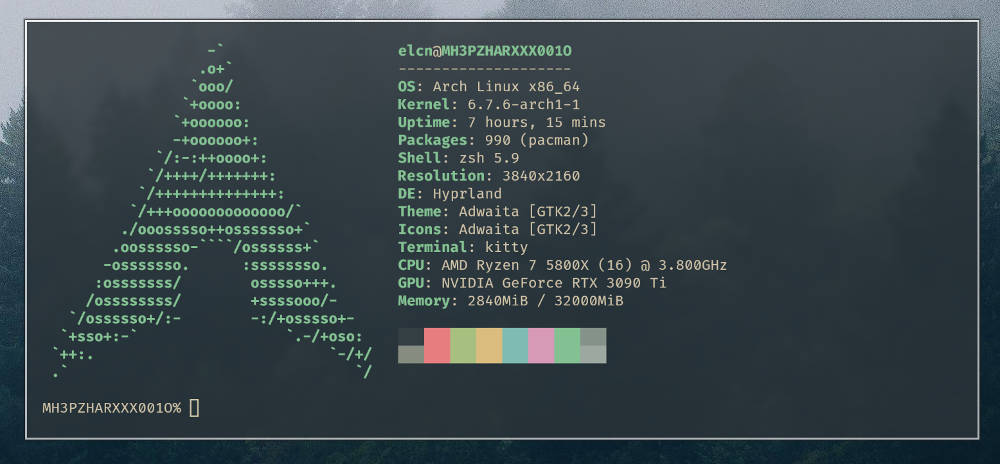

# Here's the guide

Welcome, traveller! I suppose you're here to install Arch Linux, don't wait then, let's go!

This guide will cover and explain more aspects of the installation than what you can see on the wiki [here](wiki.archlinux.org/title/Installation_guide)



# Before starting:

- Some computers won't work out of the box because of bugs left by the manufacturers ;
- Arch Linux comes with an installer, if you want to setup your system quickly or make tests, you'e better use the `archinstall` script. For a real installation, you should follow this guide ;
- This guide is for UEFI only.

# First commands:

If you don't have a QWERTY keyboard, you may want to change the layout:

- `localectl list-keymaps` to list the keymaps (obviously).

and

- `loadkeys us-acentos` < Here I load the US International layout, but choose what you want.

**For HiDPI monitors:**

- `setfont ter-132b`.

> [!NOTE]
> BIOS technology is outdated, I will consider you are using UEFI.

**Connect to the internet** 

This step is only for wifi users.

- Run the `iwctl` utility.
- If you want help, type `help`.
- `device list`.
- If the device is turned off, `device [device] set-property Powered on` then `adapter adapter set-property Powered on`.
- `station [device] scan`.
- `station [device] get-networks`.
- `station [device] connect *SSID*`.
- Then we can Ctrl+d to exit.

You should be connected, try to send a ping to check your connection:

- `ping -4c4 1.1.1.1`.

If there's a response, it works! Next step.

It's time to set up the system clock:

- `timedatectl set-ntp true`.
- `timedatectl` to check everything is fine.
Fine, let's go ahead.

# Partitioning 

This part is quite subjective, there are a lot of ways to do it. I will covers some aspects here but you should define your needs first and make more researchs about what you're about to do.

- Do `lsblk` to identify your disk(s), if you have a SATA connected drive, it will be named *sdX* where "X" is the letter of the disk. If you have a nvme ssd, it will be named *nvmeXn1* where "X" is the ssd number.
- We will use `gdisk` to partition our disk(s).

- Do `gdisk /dev/sdX`.
- `o` to create a new empty GPT table.

### Classical way

We need at least two partitions. A boot partition and the system partition.
This is the very minimal required for your system to work.

If you don't want to use the hibernate function or if you have more than 16 GiB of RAM, you can skip the swap partition. I don't recommend it however.

Minimal partition size:
- `/` should be at least 23-32 GiB.
- `/boot` should be at least 1 GiB.

Now, you should know that the best practice is to have more than two partitions. 

RedHat recommends to have those partitions:

| Directory | Minimum size |
|-----------|--------------|
|    `/`    |     10 GiB   |
|  `/usr`   |     5 GiB    |
|  `/tmp`   |     1 GiB    |
|  `/var`   |     3 GiB    |
|  `/home`  |     3 GiB    |
|  `/boot`  |     1 GiB    |

- `n` to create a new partition.
    - From here, you have to fill the interactive fields.
    - Always leave the first sector by default and write "+[XX]G" for the partition size.

We will create the partitions in this order:

- `/boot`.
- (`swap`).
- `/`.
- etc.

The Hex codes are:
- `ef00` for EFI system partition (this should be for the 1st partition, `/boot`).
- `8200` for a swap partition.
- `8300` for a standard partition.

Once you have your partitions, you can type `c` to change their names.

- Type `p` to verify and `w` to write changes to the disk.

**Format the partitions:**

- `mkfs.fat -F 32 -n ESP /dev/sdX` for the boot partition.
- `mkswap /dev/sdX` for the swap partition.
- `mkfs.ext4 /dev/sdX` for the other partitions.

- `swapon /dev/sdX` to activate the swap partition.
- `mount /dev/sdX /mnt` for the root partition `/`.
- `mount --mkdir /dev/sdX /mnt/boot` for the boot partition.
- `mount --mkdir /dev/sdX /mnt/[name of the partition]` for `/usr`, `/var`, `tmp`, etc.

- Then, do `lsblk` again to verify if everything is correct.

### LVM 

LVM *(Logical Volume Management)* has the advantage to manage partitions in a logical way. That means your system can be transferred easily as you just have to move the LVM files. It gives you also the advantage to resize your logical partitions and add or remove disks to the party.

Let's begin.

The steps are the same as above but here I will use only an ESP partition *(ef00)* of 5 GB and a standard Linux partition *(8300)* of 400 GB. No swap partitionm I will use zram.

Then, once it's done, this is where the fun begins!

First, we need to create our "PV" *(Physical Volume)*:

- `pvcreate /dev/sdX`, you can use multiple disks to create one PV ;
- `pvs` to check if the PV has been created.

> [!WARNING]
> As I don't use Grub2, I need to make a separate boot partition that is not into the LVM. Usually, we put entire disks into PVs but there, as my disk is already partitionned, I will put my second partition into the LVM like that : `pvcreate /dev/nvme0n1p2`.

Then we have to create the VG *(Volume Group)*:

- `vgcreate VG_ARCHLINUX /dev/sdX` ;
- `vgs` to check again.

Then, create our LVs *(Logical Volumes)*:

The command is `lvcreate`:
    - `-L` size of the LV ;
    - `-n` name of the LV.

- `lvcreate -L 150G VG_ARCHLINUX -n home` ;
- `lvcreate -L 20G VG_ARCHLINUX -n usr` ;
- `lvcreate -L 5G VG_ARCHLINUX -n tmp` ;
- `lvcreate -L 10G VG_ARCHLINUX -n var` ;
- `lvcreate -l 100%FREE VG_ARCHLINUX -n root` *(It's a little "l" here, not a mistake)*.

- `lvs` to check once more.

**Formatting:**

- `mkfs.fat -F 32 -n ESP /dev/sdX` for the boot partition ;
- `mkfs.xfs /dev/mapper/[VG_NAME]-[lv_name]` do that for all of your LVs, you can choose something else than XFS if you want.

Then, we can do `lsblk -f` to check if everything's ok.

Finally, we need to mount the LVs and the boot partition.

### Installation

- Open the file `/etc/pacman.conf` and uncomment the lines `#ParallelDownloads = 5` and `#Color`.
- Do `pacman-key --refresh-keys` to ensure the keyring is up to date.

Then, we will now install the base system:

- `pacstrap -i /mnt base{,-devel} dkms linux{{,-lts}{,-headers},firmware}`.

Here is the command I recommend to use, but note that it's my personnal preferences, select the packages you want instead of copying this line blindly:

- ```pacstrap -i /mnt base{,-devel} dkms linux{{,-lts}{,-headers},-firmware} git man-{db,pages} vim networkmanager openssh polkit zsh{,-{autosuggestions,completions,history-substring-search,syntax-highlighting}} tmux tldr texinfo```.

- Create the fstab file with `genfstab -U /mnt >> /mnt/etc/fstab`.

### System configuration

Now, it's time to do `arch-chroot /mnt` to go into your fresh installed system!

If you forgot to install packages, you can do `pacman -S [package name]` to install them.

To get the right date and hour according to your location, you have to do this command, make sure to replace "Europe" and "Paris" if you need to:

- `ln -sf /usr/share/zoneinfo/Europe/Paris /etc/localtime`.

- Then, do `hwclock --systhoc` to update the hardware clock.

- Open the file `/etc/locale.gen` and uncomment `en\_US.UTF-8` and any other locales you want to use.
- Do `locale-gen` to generate the uncommented locales.

- Do `echo LANG=[LOCALE] > /etc/locale.conf` **[LOCALE]** being your preferred locale from the ones you just generated.
- Do `echo KEYMAP=[KEYMAP] > /etc/vconsole.conf` **[KEYMAP]** being the name of the keymap you set up with `loadkeys` (if you did it).
- Do `echo FONT=lat0-16 >> /etc/vconsole.conf`. You can find all fonts available in `/usr/share/kbd/consolefonts`.

- Do `echo [HOSTNAME] > /etc/hostname` **[HOSTNAME]** being the name you want your system to have.
- The hostname must be compatible with the following regex expression: `^(:?[0-9a-zA-Z][0-9a-zA-Z-]{0,61}[0-9a-zA-Z]|[0-9a-zA-Z]{1,63})$`.

- Edit the file `/etc/hosts` to contain the following:

```bash
# Static table lookup for hostnames.
# See hosts(5) for details.

127.0.0.1 localhost.localdomain localhost localhost-ipv4
::1       localhost.localdomain localhost localhost-ipv6
127.0.0.1 HOSTNAME.localdomain  HOSTNAME  HOSTNAME-ipv4
::1       HOSTNAME.localdomain  HOSTNAME  HOSTNAME-ipv6
```
- **"HOSTNAME"** being the hostname you chose earlier.

- Enable some services with `systemctl enable`:
    - `sshd` if you want to connect to your machine by ssh ;
    - `NetworkManager` if you want some internet in your machine ;
    - `systemd-resolved` for the network name resolver service by systemd ;
    - `fstrim.timer` if you have a SSD.

- Edit the file `/etc/mkinitcpio.conf` and change `udev` to `systemd` in the `HOOKS` list.
- Update the initramfs by doing `mkinitcpio -P`.

- Do `passwd` to change the `root` user password.

> [!WARNING]
> I don't recommend you to allow to log in as the root user. It's a security vulnerability. You should be able to get root with your user account but not to log in directly into it. I won't describe the way to achieve this in this tutorial but you should inform yourself about that.

You can also create your user:

- `useradd -G wheel -s /bin/zsh -m -U [USERNAME]` **[USERNAME]** being what you want.

Now, let's install the microcode updater:

- `pacman -S intel-ucode` if you have an Intel CPU ;
- `pacman -S amd-ucode` if you have an AMD CPU.

### Bootloader 

There are two major choices for the bootloader:

- GRUB2 ;
- rEFInd.

I personnaly prefer Refind as it's easier to configure and customize.

To install it: 

- `pacman -S refind`.
- Then `refind-install`.

Now, to be able to boot into your system, you have to do this:

- `echo Arch Linux root=UUID=$(blkid -o value -s UUID /dev/sdX) > /boot/refind_linux.conf` where *sdX* is your root partition.
- `echo resume=UUID=$(blkid -o value -s UUID /dev/sdX) >> /boot/refind_linux.conf` where *sdX* is your swap partition (not necessary if you don't have a swap partition).

The file should look like this :

```
"Arch Linux"    "root=UUID=[The uuid of your root partition] resume=UUID=[The uuid of the SWAP partition] rw initrd=[UCODE].img initrd=initramfs-%v.img [EXTRA]
```

Where **[UCODE]** is the name of the microcode you've installed earlier *(AMD or Intel)* and **[EXTRA]** are extra kernel parameters like "splash" and/or "quiet".

### Final

Now, we have a minimal installation, we could quit and reboot like that :

- `Ctrl + d` and then `umount -R /mnt`.
- Then `reboot now`.

- After logging in as the root user, you have to do `timedatectl status` to check the time.

But, if you want to achieve this guide correctly, let's continue a bit...

### Final touches


#### Creating a user

To create a user :

- `useradd -m -U -G wheel -s /bin/zsh [USERNAME]`.

- `-m` to create a home directory for the new user ;
- `-U` to create a group with the same name as the user ;
- `-G` to add supplementary groups to the new user, `wheel` here ;
- `-s` to change the default shell of the new user ;
- **[USERNAME]** being the username you want.

Then to change the new user's password:

- `passwd [USERNAME]`

Then, you can do `visudo` to edit the sudoers file and uncomment the line `# %wheel ALL=(ALL) ALL`.

#### Getting the wifi

To connect the internet, if you're not wired, you have the choice:

- Use `ntmui` to have a ui to NetworkManager ;
- Or use the following commands to connect:
    - `nmcli device wifi list`;
    - `nmcli device wifi connect [SSID] password [PASSWORD].

- Then, if everything seems to be working, test your connection with a simple `ping -4c4 1.1.1.1`.

#### Configure pacman

Do you remember, ~~president Nixon~~ what we did at the beginning? We must do the same now.

- Open the file `/etc/pacman.conf` and uncomment these lines:
    - `# Color` ;
    - `# ParallelDownloads = 5`.
- Then, do `pacman -Syu` to update pacman's configuration and perform any updates available.

#### Install an AUR helper

This step is not mandatory but I highly recommend it to enjoy the particularities of Arch Linux.

`Paru` in my opinion is a good choice, it's a wrapper for Pacman that can install AUR packages.

[Here's the link to paru](github.com/Morganamilo/paru)

# Finally, you have a well running minimal Arch Linux installation! Don't forget to make care of what you are doing with it, things can break easily. Have fun with it!

TODO:

- [ ] Add a BTRFS section ;
- [X] Add a LVM section ;
- [ ] Go deeper in the subject.
